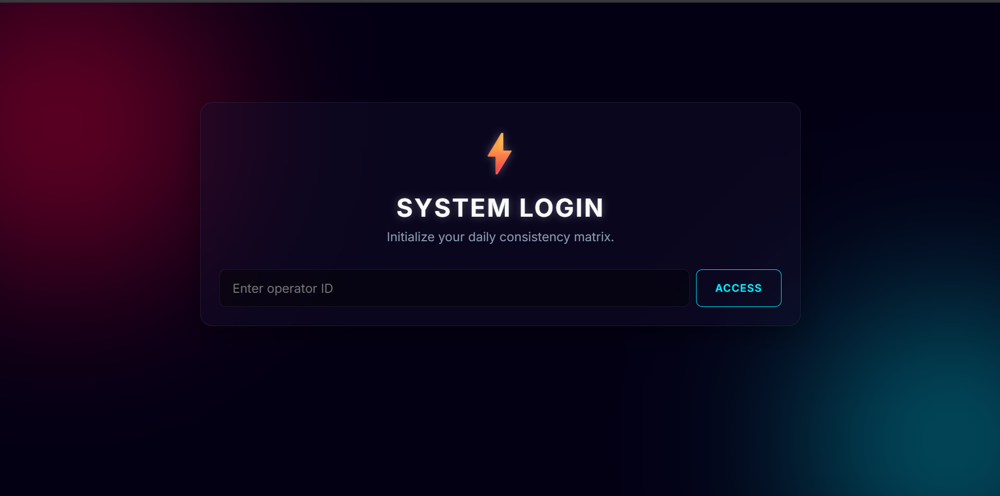
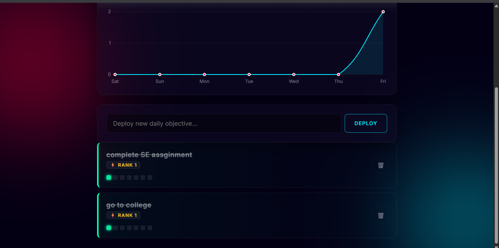

# forge
# 🔥 Forge — Personal Productivity & Consistency Tracker

Forge is a minimal and powerful productivity web app designed to help users build daily consistency through task tracking and streak management.

##  Features

* Simple login (username-based)
* Add and manage daily tasks
* Mark tasks as ✅ Done or ❌ Not Done
* Automatic streak tracking system
* Unfinished tasks carry forward to next day
* Data logging to Google Sheets (via Google Apps Script)

##  Tech Stack

* HTML, CSS, JavaScript
* Google Sheets (Database)
* Google Apps Script (Backend API)

##  How It Works

* Tasks are stored locally using localStorage
* Every action (Done / Not Done) is logged into Google Sheets
* Streak logic tracks daily consistency
* Clean and minimal UI for distraction-free usage

##  Purpose

This project is built to:

* Improve personal discipline
* Track consistency over time
* Serve as a real-world portfolio project

##  Future Improvements

* Progress graphs & analytics
* Multi-device sync
* Notifications & reminders
* Authentication system

## 📸 Screenshots

##  Live Demo

(https://comforting-maamoul-d21cc7.netlify.app/)

---

> Built with focus, discipline, and late-night energy ⚡
